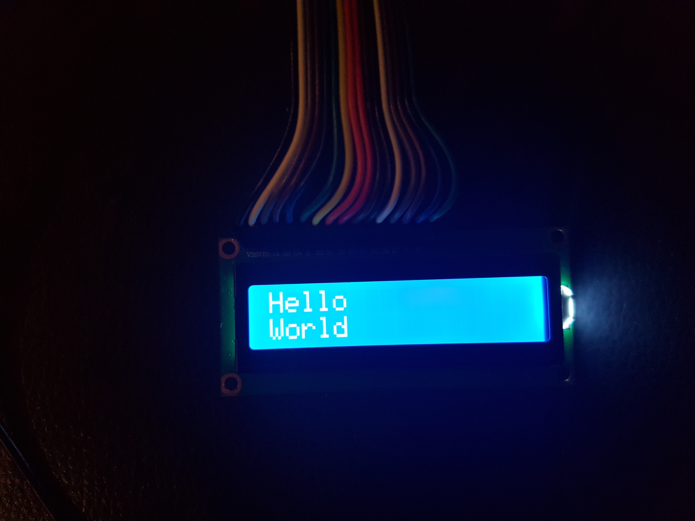
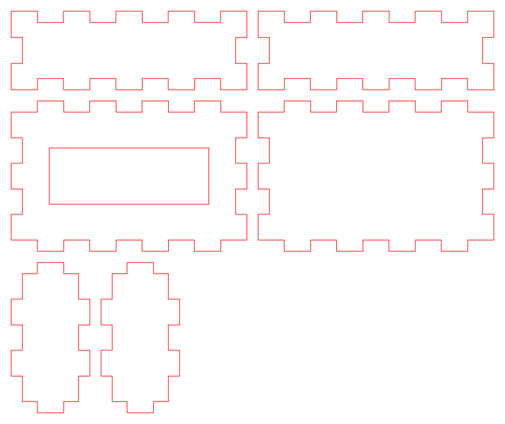

# About

My wife and I are using the OurHome application to schedule the tasks &
groceries list. My idea was to have a "TODO Box" based on a RaspberryPI & and a
Liquid Crystal LCD screen to show out our data from the OurHome app directly
into the screen. The box can be plugged onto the fridge.

Then after, I decided that any data could be printed out: we also have a
raspberry PI running on our balcony (named `outdoor`, with the outdoor
temperature as well as a pollution - PM10 & PM2.5 - metrics gathering) that
could also be desplayed.

The idea would be to have a "All-in-One" info box directly in our kitchen.

* Pollution metrics printing
* TODO / Chores listing
* Groceries list
* Outdoor & indoor temperature
* ...

So this project is about:

* Basically getting data from the OurHome App
* Getting data from elsewhere (grafana ?)
* Parsing and putting them on the LCD screen regularly

I decided to do it in C/C++, because my first attempts was by using an I2C
library in C++, and I wanted to dig in the language once again.

# Prototype

## Screenshot



## raspberry pi box schematics

To be cut with a Laser cutter.



## Finding the i2c address

To find the i2c address for the screen, one can use the `i2cdetect` command:

```
$ i2cdetect -y 1
     0  1  2  3  4  5  6  7  8  9  a  b  c  d  e  f
00:          -- -- -- -- -- -- -- -- -- -- -- -- -- 
10: -- -- -- -- -- -- -- -- -- -- -- -- -- -- -- -- 
20: -- -- -- -- -- -- -- 27 -- -- -- -- -- -- -- -- 
30: -- -- -- -- -- -- -- -- -- -- -- -- -- -- -- -- 
40: -- -- -- -- -- -- -- -- -- -- -- -- -- -- -- -- 
50: -- -- -- -- -- -- -- -- -- -- -- -- -- -- -- -- 
60: -- -- -- -- -- -- -- -- -- -- -- -- -- -- -- -- 
70: -- -- -- -- -- -- -- --                         
```

Then we have to adapt in the source code (`main.cpp`) the constant `LC_ADDRESS`.

## Wiring the button

A button allows to switch to the next item to be displayed. It is hardcoded to
use the GPIO 16 (in the `Wpi*` scheme), see:
https://raw.githubusercontent.com/ppelleti/hs-wiringPi/master/pin-diagram.png

One of the pin has to be wired onto the "pin 16", the other one can go onto a
3.3V output.

# Launching as a service (systemd configuration)

A sample `infobox.service` is provided in the `docs/` subdirectory:

```
$ cp docs/infobox.service /lib/systemd/system/
$ systemctl daemon-reload
$ service infobox start
```


# Caveats

The LCD screen is unable to print out accented characters, and well we are
living and exchanging in french ...  That is why after having tried to use the
`iconv` library with no luck, I finally used the libglib to transliterate our
UTF-8 strings into ASCII.


# Requirements

* libcurl (package `libcurl4-gnutls-dev`)
* libjson-cpp (package `libjsoncpp-dev`)
* libglib (package `libglib2.0-dev`)

